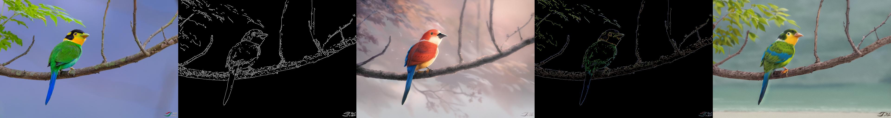
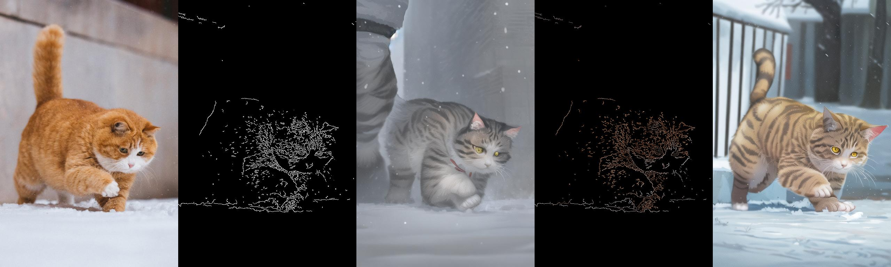
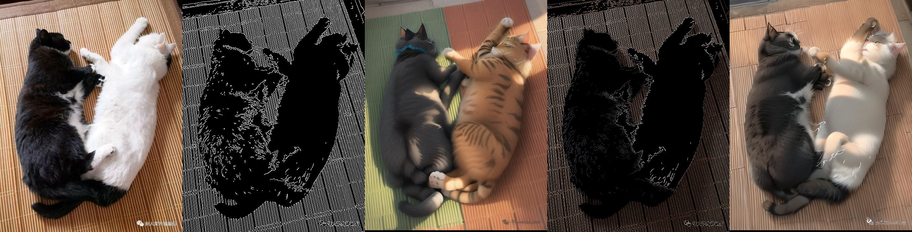
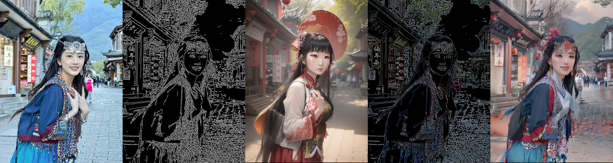
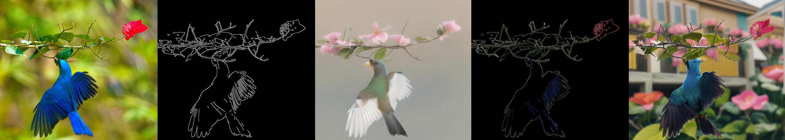
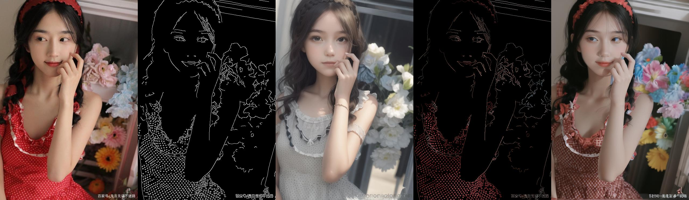
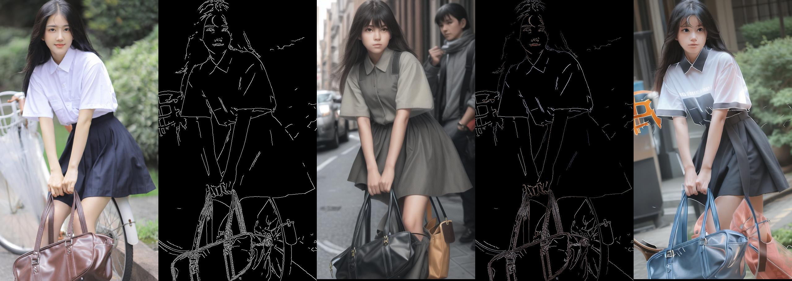

# ___***ControlNet-Colorful: add color to controlnet results***___

<a href='https://ControlNet-Colorful.github.io'></a> 
<a href='https://huggingface.co/ControlNet-Colorful'></a>
[](https://github.com/fastisrealslow/ControlNet-Colorful/)


---


## Introduction

Stable Diffusion and ControlNet are so easy to use, a large number of users use Canny and Lineart to control the Stable Diffusion model to generate rich content. But in actual scenarios, users hope to control the color space of the generated image in addition to outline and content control.

We found that there is no tool on the market that can control the generated color more accurately. We proposed ControlNet-Colorful, which adds color control information to the basic model of ControlNet (canny/lineart), and can convert pre-trained text to images. The diffusion model implements color control functions.

Under the same model parameter size and inference speed, it can achieve equivalent or even better results than the official model. ControlNet-Colorful can generalize to other custom models fine-tuned from the same base model, as well as to controllable generation using existing controllable tools.



## Release
- [2024/1/12] 🔥 We release the code


## Installation

```
# install latest diffusers
pip install diffusers==0.22.1

# download the models
cd ControlNet-Colorful

# then you can use the annotator
```

## Download Models

you can download models from [here](https://huggingface.co/h94/IP-Adapter). To run the demo, you should also download the following models:
- [runwayml/stable-diffusion-v1-5](https://huggingface.co/runwayml/stable-diffusion-v1-5)
- [ControlNet models](https://huggingface.co/lllyasviel)

## Demo
### color canny demo (revAnimated_v122)




### color canny demo (dreamshaper_8)





## How to Use
### 1. colorful canny annotator
    from annotator import colorful_canny

    image = cv2.imread(jpg_path)
    image, _ = colorful_canny(image, short_len=512, colorful=True)
    control_image = Image.fromarray(image)
       
### 2. diffusers pipeline
    checkpoint = "lllyasviel/control_v11p_sd15_canny"
    basemodel_path = "runwayml/stable-diffusion-v1-5"
    
    controlnet = ControlNetModel.from_pretrained(checkpoint, torch_dtype=torch.float16)
    
    pipe = StableDiffusionControlNetPipeline.from_pretrained(
        basemodel_path, controlnet=controlnet, torch_dtype=torch.float16
    )

    pipe.scheduler = UniPCMultistepScheduler.from_config(pipe.scheduler.config)
    pipe.enable_model_cpu_offload()
    
    pipe = StableDiffusionControlNetImg2ImgPipeline.from_pretrained(
	    base_model, torch_dtype=torch.float16, 
        controlnet=[
		    controlnet_pose,
	    ],
    ).to("cuda")

    image = pipe("a cat walking in the snow", num_inference_steps=20, generator=torch.manual_seed(0), image=control_image).images[0]

    image.save('images/image_out.png')


## Disclaimer

This project strives to positively impact the domain of AI-driven image generation. Users are granted the freedom to create images using this tool, but they are expected to comply with local laws and utilize it in a responsible manner. **The developers do not assume any responsibility for potential misuse by users.**

## Thanks
This implementation is inspired by [lllyasviel/ControlNet](https://github.com/lllyasviel/ControlNet) and [bmaltais/kohya_ss](https://github.com/bmaltais/kohya_ss)
